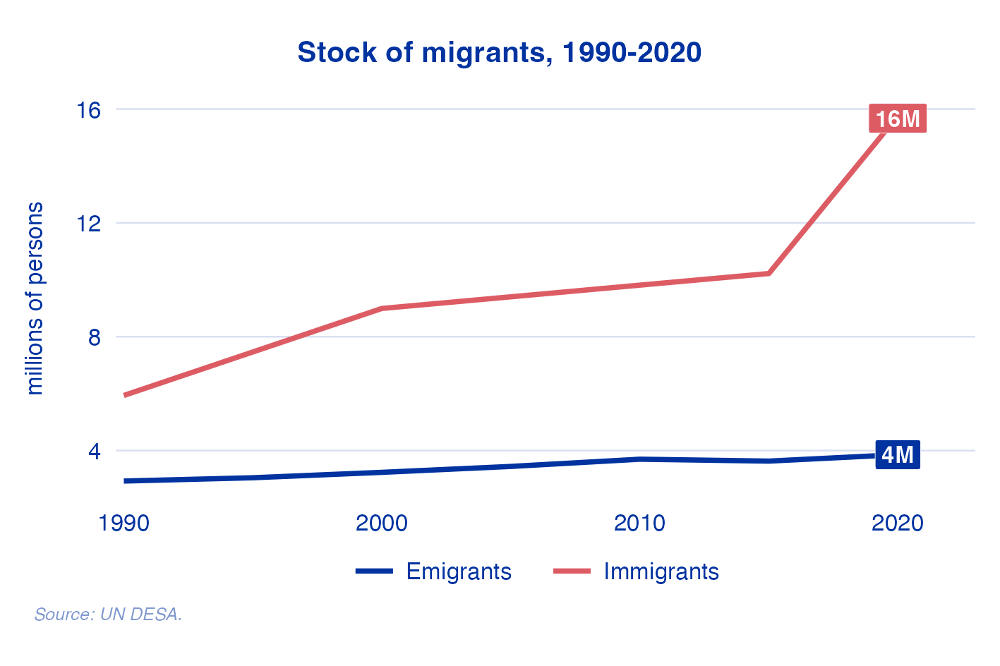
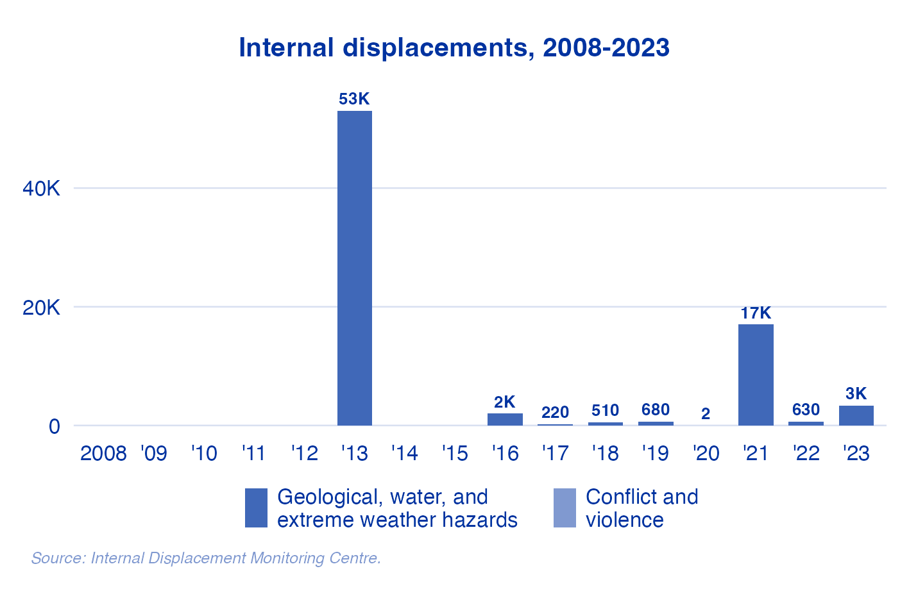

<!-- README.md is generated from README.Rmd. Please edit that file -->

```{r, include = FALSE}
knitr::opts_chunk$set(
  collapse = TRUE,
  comment = "#>",
  fig.path = "man/figures/README-",
  out.width = "100%"
)
```

# gdiviz

<!-- badges: start -->
<!-- badges: end -->

This package is a collection of data and tools that allows for the easy production of charts. 

## Installation

You can install the development version of gdiviz from [GitHub](https://github.com/) with:

``` r
# install.packages("devtools")
devtools::install_github("ksreyes/gdiviz")
```

## Getting started

The key function of this package is `gdiplot()`, which generates a `ggplot` chart from a list of chart templates. It requires two arguments: `code`, which determines the variable and chart type to be created, and `country`, which is the 3-letter ISO code of the country to chart. 

```r
library(gdiviz)
gdiplot(code = "stocks", country = "DEU")
```

{width=550}
```r
gdiplot(code = "popmap", country = "DEU")
```

{width=550}

```r
gdiplot(code = "idp", country = "DEU")
```

{width=550}

To see the list of available charts and their respective codes, run `gdiplots`. Charts can be exported as SVG or PNG files with the `export` argument. See `?gdiplot` for more information on this and other arguments.

The underlying data are bundled with this package and are available to users. Run `gdidata` to see the list. To check data availability for a country, run `check_data(iso)`, where `iso` is the 3-letter ISO code.

Datasets are indexed by ISO codes. For the user's convenience, `countryname()` can be used to look up the corresponding country name. For example, `countryname("DEU")` returns "Germany". The reverse is also possible, with `countryname("Germany", from = "name", to = "iso3c")` returning "DEU". Alternatively, run `countrynames` to see the full list of countries.

## Advanced usage

The function `apply_theme()` can be used to apply IOM theming to any `ggplot` chart. For example:

```r
library(ggplot2)
library(gdiviz)

iris |>
  dplyr::summarise(Sepal.Length = mean(Sepal.Length), .by = Species) |>
  ggplot(aes(x = Species, y = Sepal.Length)) +
  geom_bar(stat = "identity", fill = pal("blues")) +
  ggtitle("The iris dataset") +
  apply_theme("bar-vertical")
```

{width=550}
Default sizes are optimized for export as an image with width 12 cm at 300 dpi. IOM color palettes are also available using `pal()`. See function documentation for details. 

## Disclaimer

I wrote this package to make my job easier. Nothing here has the official endorsement of my employer.
